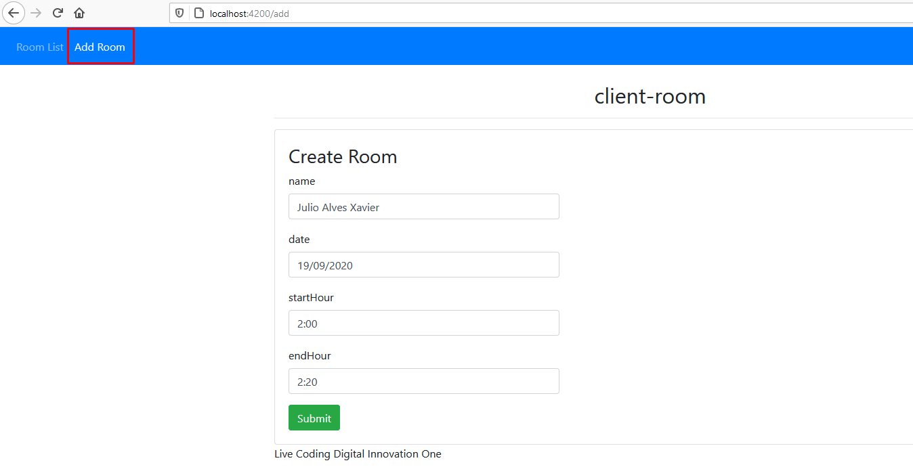
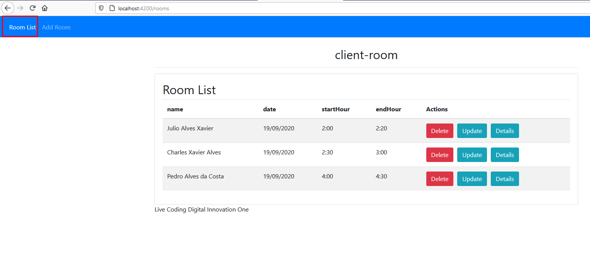
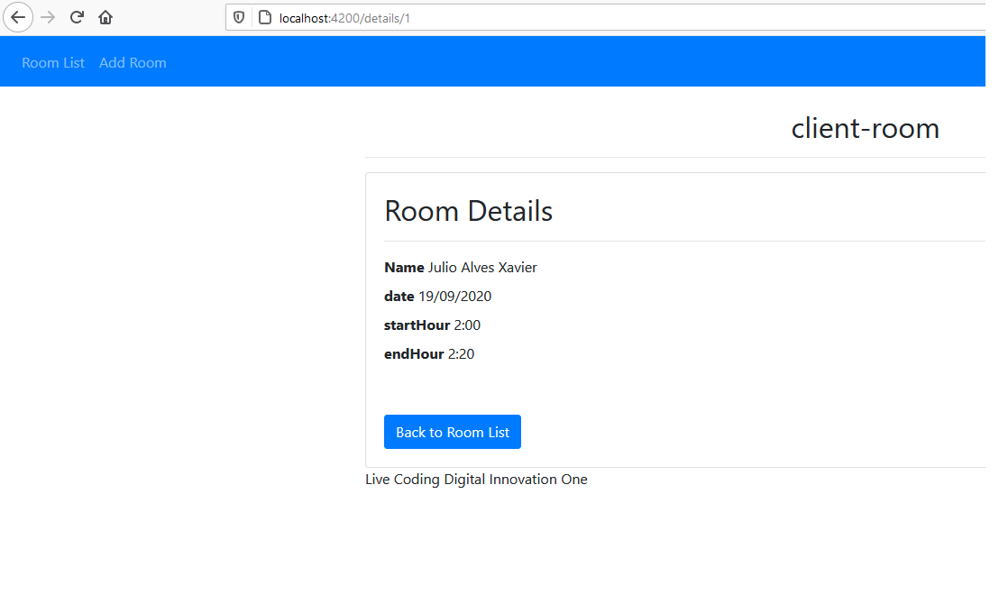

# GerenciadorDeSalasDigitalinnovation
 Bootcamp Java Digital innovation

<h3>Tecnologias e Ferramentas :</h3>
<ul>
  <li>Java JDK 1.8</li>
  <li>Spring tool suite 4</li>
  <li>GitHub</li>
  <li>Banco H2</li>
  <li>JPA</li>
  <li>Angular</li>
  <li>Bootstrap</li>
  <li>Jquery</>
  <li>TypeScript</li>
</ul>

<h3>Screenshot :</h3>

<h3>Instalação</h3>
<h6>Requisitos</h6>
<ol>
 <li>JRE OU JDK a partir da versão 1.8 instalado no pc</li>
 <li>IDE Spring tool suite</li>
 <li>Node</li>
</ol>

